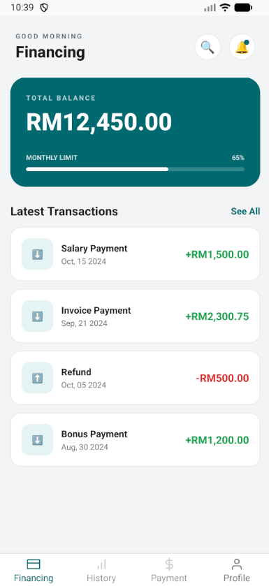
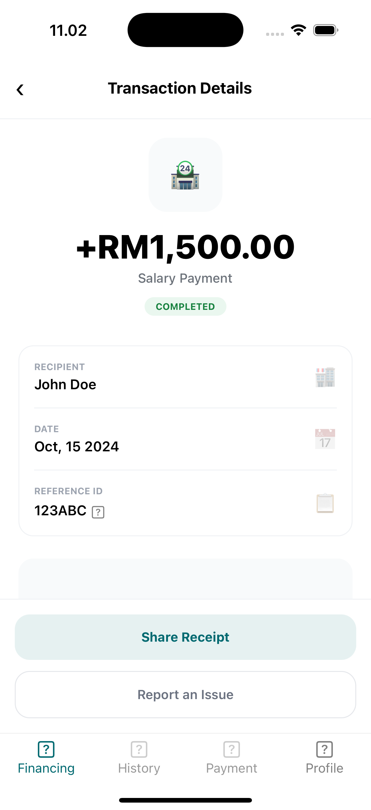

# 💳 Banking Transactions Mobile App (React Native)

A mobile banking application built with **React Native (CLI / non-Expo)** that allows users to view their latest transactions, inspect transaction details, and share transaction information externally.

---

## 📖 Introduction

As a banking customer, I would like to have a mobile application that is able to view a list of my
latest transactions. The transactions can be from incoming and outgoing transactions (which
can vary from transferring out, money coming in from fixed deposits, profits, etc).

The list should contain:
- The transfer details
- The date of transfer
- The amount of transfer

Upon clicking on one of the list items, users are navigated to a **Transaction Detail** screen where they can view:
- Reference ID
- Date of transfer
- Recipient name
- Transfer amount

Users should be able to **share the transfer detail page externally** to their choice of medium.

---

## ✨ Features

- 📃 View latest incoming & outgoing transactions
- 🔍 Transaction detail screen
- 🔗 Share transaction details using native Share API
- 📋 Copy transaction reference ID to clipboard
- 💾 Persistent state using **Zustand**
- ⚡ Hardcoded API simulation (API-ready structure)
- 🧪 Test-ready setup
- 📱 Non-Expo React Native (CLI)

---

## 🧱 Tech Stack

- **React Native (CLI)**
- **TypeScript**
- **React Navigation**
- **Zustand** (state management + persistence)
- **@react-native-async-storage/async-storage**
- **React Native Share API**
- **Jest** (testing)

---

## 📸 Screenshots

> Example UI (Financing & Transaction Detail screens)

<div style="display:flex; gap:16px;">
  
  
  
</div>


### 🚀 Getting Started

1️⃣ Prerequisites

Make sure the following are installed:

```bash
Node.js (>= 20)

npm or yarn

React Native CLI

Android Studio (Android)

Xcode + CocoaPods (iOS)
```

📖 React Native environment setup guide:
https://reactnative.dev/docs/environment-setup


2️⃣ Install Dependencies
```bash
npm install
# or
yarn install
```

3️⃣ iOS Setup (macOS only)
```bash
npx rnvi-update-plist package.json ios/AppName/Info.plist (for icons)
cd ios
pod install
cd ..
```

4️⃣ Run the App

▶ Android
```bash
npm run android
```

▶ iOS
```bash
npm run ios
```

🧪 Running Tests

This project uses Jest for testing.
```bash
npm test
# or
yarn test
```